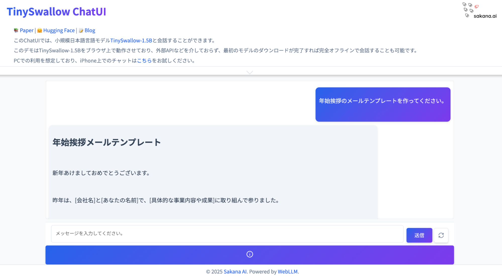

# TinySwallow ChatUI
📚 [Paper](https://arxiv.org/abs/2501.16937) | 🤗 [Hugging Face](https://huggingface.co/collections/SakanaAI/tinyswallow-676cf5e57fff9075b5ddb7ec) | 📝 [Blog](https://sakana.ai/taid-jp)

<div align="center">

</div>

TinySwallow ChatUIは、ブラウザ上で動作するローカルな言語モデルチャットアプリケーションです。

**特徴:**

- 📱外部APIなどを介さず、最初のモデルのダウンロードが完了すれば完全オフラインで会話することも可能です。
- 🔐 すべての処理がローカルで実行されるため、データが外部に送信されることはありません。
- ⚡️ 複雑なセットアップ不要で、ブラウザから直接チャットを始めることができます。

すぐにチャットを始めたい場合は、[こちら](https://pub.sakana.ai/tinyswallow/)からお試しください。なお、このデモにおいても、チャットはお使いのPCで動作され、データがSakana AIに送られることはありません。

## 使い方

### 1. リポジトリのクローン

```bash
git clone https://github.com/SakanaAI/TinySwallow-ChatUI.git
cd TinySwallow-ChatUI
```

### 2. HTTPサーバーを起動

ターミナルを開き、HTTPサーバーを起動します。
例えば、Pythonを用いる場合は以下のコマンドを実行します。

```bash
python -m http.server 8000
```

⚠️ Windowsの場合、pythonを事前にインストールする必要があります。

### 3. ブラウザでアクセス

任意のブラウザで以下のURLにアクセスします。

```
http://localhost:8000
```

## 完全なローカル実行が必要な場合

このTinySwallow ChatUIでは、最初のモデルダウンロード時に、ネットワークが必要です。

完全にローカル環境でモデルを実行したい場合は、[TinySwallow-ChatUI-Local](https://github.com/SakanaAI/TinySwallow-ChatUI-Local)をご利用ください。このレポジトリでは、モデルファイルも含まれており、ネットワークを必要なく、ローカルでチャットが可能です。

## 利用上の注意

本アプリケーションは実験段階のプロトタイプであり、研究開発の目的でのみ提供されています。商用利用や、障害が重大な影響を及ぼす可能性のある環境（ミッションクリティカルな環境）での使用には適していません。 本アプリケーションの使用は、利用者の自己責任で行われ、その性能や結果については何ら保証されません。 Sakana AIは、本アプリケーションの使用によって生じた直接的または間接的な損失に対して、結果に関わらず、一切の責任を負いません。 利用者は、本アプリケーションの使用に伴うリスクを十分に理解し、自身の判断で使用することが必要です。
